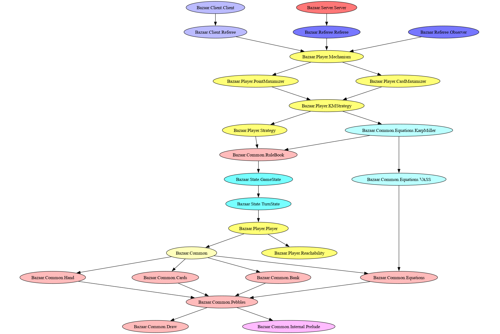

# Purpose
This directory contains the code for the common game elements of Bazaar.

# Files
- Internal/
    - Prelude
        - Provides imports the decrease the messiness in the remaining code files
- Equations/
    - Contains modules to solve Vector Addition Systems
- Cards.hs
    - Contains the `Card` data structure and related functionality
- Draw.hs
    - Defines a class for structures that 'can be converted into 2d diagrams'
- Equations.hs
    - Contains the `Equation` and `EquationTable` data structure as well as provides functionality for filtering and using equations/the equation table
- Hand.hs
    - Contains a representation of the players' `Hand` of pebbles
- Bank.hs
    - Contains the representation of the game's bank of pebbles.
- Pebbles.hs
    - Contains the `Pebble` and `PebbleSet` data structure as well as operations on `PebbleSets`
- GameState.hs
    - Contains the `GameState` data structure and related operations
- TurnState.hs
    - Contains the `TurnState` data structure and related operations
- RuleBook.hs
    - Contains functions for verifying player actions. Likely to be further
    abstracted, but currently is chiefly 'verifyCardBuy' and 'verifyPTAction'
# Testing

To run the test suite, run `/xtest` from the project directory.

Ideally, instead of using `/xtest` directly, one uses `Nix` to create a
devshell, from which one can run `cabal test all` to run the test suite. `nix
build` will also run tests as a part of the build process.

# File Relationship
Cards, Equations, and Hand all represent and export functionality related to that game element. These modules in turn, interact with Pebblese in some form (exchanging, satisfying, holding, etc.). Then all of these elements must be drawable to the GUI.

Internal/Prelude is a way to collect common imports and is imported by every game element module.

Arrows represent 'imports'/'uses'.
