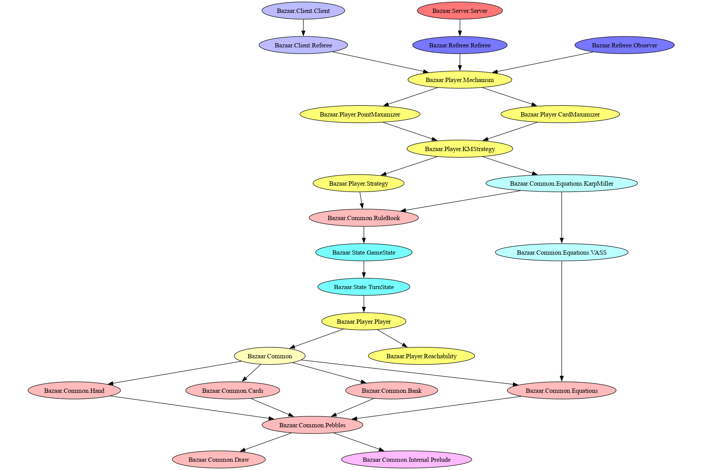

# Bazaar Game
The Bazaar game is a trading game for 2 to 6 players. The playing field is made
up of two items:
1. Cards that players must purchase to get points, and
2. Equations that allow players to trade what they own for alternatives.

Players own “pebbles,” a form of currency and keep them hidden from other
players. With these pebbles they can acquire the displayed cards; each purchase
yields a number of points depending on what the card displays and on how many
pebbles the player has left. Once a card is purchased, it is replaced with
another one. Players can also exchange (some of) their pebbles with a bank
according to the displayed equations.

The player with the highest total score wins when the game is over.

## High Level Overview

There are three independent high-level modules:
1. Cards
2. Equations
3. Hand

Cards defines the `Card` used as a scoring item in *Bazaar*. Cards are generated
via `mkRandomCard` from a provided source of randomness; it is expected the
`Referee` (not yet defined) would generate these for a game, therefore the
constructors are not exposed.

Equations defines `Equation` and `EquationTable` and the operations on them.

Hand defines `Hand`—the collection of `Pebble`s held in secret by `Player`s.

These modules depend on Pebbles, which defines `Pebble`, `PebbleSet`, and its
respective `ToPebbleSet` and `FromPebbleSet`.

Finally, Equations, Cards, and Pebbles all depend on Draw, which defines the
`Draw` typeclass, allowing the conversion between a value and a Diagram.

Internal modules are not discussed. Indeed, `Bazaar.Common.Internal.Prelude` is
entirely reexports, bar a single function on lists.

## Running Tests
To run the test suite, run `./xtest` from the project directory. Running tests
via `./xtest` does *not* test modified code; it is a static binary updated before
pushing. To run tests on the current worktree, read on to the next paragraph.

Ideally, instead of using `./xtest` directly, one uses `Nix` to create a
devshell, from which one can run `cabal test all` to run the test suite. `nix
build` will also run tests as a part of the build process.

## Relations between Modules

The graph displays the dependecies between modules, where an arrow denotes
importing and/or using. Arrows already fulfilled by an import (even indirectly)
are omitted, even though the module may directly import its grandpartent (e.g.,
Equations directly imports Draw).
